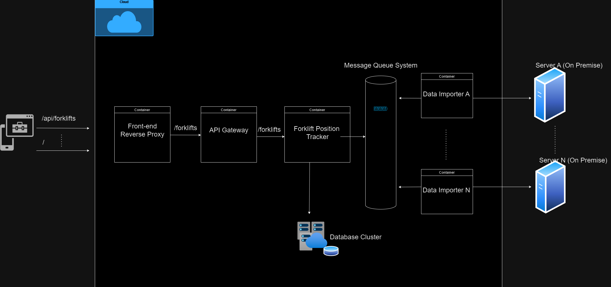

## Define the most suitable software architecture.

Having in consideration that there will be a local on premise server collecting
the position and metadata coming from the bluetooth tracking devices at every facility,
then we would be aiming to build a system that is scalable, reliable and secure.

Microservices based architecture is a modern way which can help modularize the system down to smaller,
easier to manage and maintain components. Docker plays a role in containerizing every
component of the software solution neatly packaging all runtime dependencies into images that can 
be deployed into a variety of infrastructure either physical on premise servers or cloud based
infrastructure service provider (AWS, Azure, Digital Ocean, and so on).

The rationale of choosing a distributed architecture is to think ahead into the future with
horizontal scalability in mind and flexibility for future expansion in the form of new features rollout,
so that the overall platform is able to handle a larger number of devices and users concurrently
as both end user and forklift traffic increases along with potentially increasing amount of
incoming data, in preparation for when the fleet of forklifts were to increase.
This architectural design shares the vision that our software solution will not become the bottleneck
for data ingestion.

A modern queue system such as Apache ActiveMQ or the more advanced Apache Kafka can further be used as 
a means to decouple the process of data ingestion (position + metadata from the forklifts) using 
the producer/consumer pattern for data processing purposes. This will help improve both performance 
and scalability across multiple facilities spread geographically around the globe. The advantage
of having message queues is to enable asynchronous processing and give the system the necessary
buffer dampening potential peak loads from incoming data ingestion and smoothening the overall
responsiveness.

The database can be a centralized data store to persist the data from all the tracked devices 
(forklifts), and can be hosted on the cloud as major cloud service providers such as Azure 
and Amazon offers database services with high availability, geographical redundancy, automated
back up and recovery procedures that can ease the operation burden to maintain a dedicated database
and reduce operational costs to the business.

The application front end component should be served behind a load balancer which will provide user
horizontal scalability that can handle peak workloads better and also will provide a layer of
security based on HTTPS with certificates that proves the authenticity of the url and establish
encryption of the user data that is served end to end from any part of the world.

Communication of requests coming in from the Javascript front-end will reach an API gateway inside
the cluster instead of reaching the individual components and this is a good practice since the back end
logic and different components can change overtime due to business requirements and requests hitting
the individual microservices directly would be otherwise viewed as a software anti-pattern.

The application could poll each on premise server located at the facilities and fetch the required
coordinates from the bluetooth tracking devices which are exposed by the on premise servers. If the 
on premise servers are exposing the API endpoint without encryption or other security measures, then
dedicated VPNs connecting the networks can be established to make this last mile connection secure,
thus preventing security breaches such as man-in-the-middle attacks.
  

## Design the Entity Relationship Diagrams.
  

## How to run on the local computer (an instance of local Kubernetes is assumed to be pre-configured and running)

Build and package the .jar with Maven for the following Java Springboot components:

api-gateway, forklift-mock-simulator, forklift-position-tracker

### General commands and URLs:

Angular
http://localhost:30080/

Queue
http://localhost:30010/

API Gateway
http://localhost:30020/vehicles/

docker build -t webapp-angular:1.0 .

docker build -t queue:1.0 .

docker build -t forklift-mock-simulator:1.0 .

docker build -t forklift-position-tracker:1.0 .

docker build -t api-gateway:1.0 .

kubectl apply -f .

Exec into mongoDB container and type mongo.

kubectl exec -it mongdb sh

show dbs

use test

show collections

db.vehiclePosition.find()

## Screenshots from the Proof of Concept.

The database will be periodically populated with the incoming position data (mock data for testing purposes).

 
You should expect to see the following Angular front-end in the browser updating in real time
as soon as the mock data is continously arriving.

